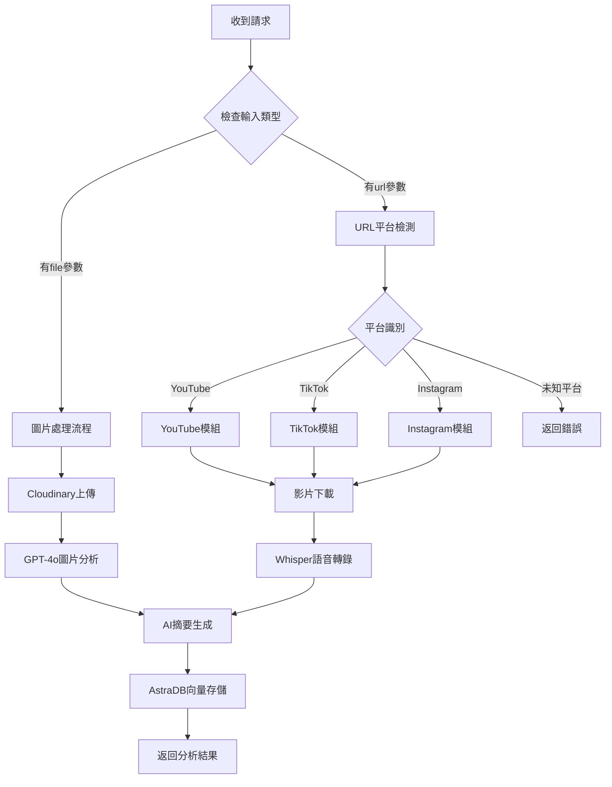

# 🎬 isMemory Upload API

一個智能的多媒體內容分析API，支援自動識別並處理YouTube、TikTok、Instagram影片以及圖片上傳，提供AI驅動的內容分析和向量化存儲。

## ✨ 核心功能

- 🔗 **智能URL識別**：自動檢測影片平台（YouTube、TikTok、Instagram）
- 📸 **圖片上傳分析**：支援拖拽上傳，AI視覺分析
- 🎙️ **語音轉文字**：使用OpenAI Whisper進行音頻轉錄
- 🧠 **AI內容理解**：GPT-4o生成摘要、提取重要時間和地點
- 🗄️ **向量化存儲**：AstraDB向量數據庫，支援語義搜索
- ☁️ **雲端儲存**：Cloudinary圖片存儲服務

## 🏗️ 系統架構

```
upload-api/
├── app.py                 # 🚀 FastAPI主應用程式
├── ai_processor.py        # 🧠 AI分析處理模組
├── astra_db_handler.py    # 🗄️ AstraDB數據庫操作
├── youtube_module.py      # 📺 YouTube影片處理
├── tiktok_module.py       # 🎵 TikTok影片處理
├── instagram_module.py    # 📷 Instagram Reels處理
├── image_module.py        # 🖼️ 圖片上傳與分析
├── frontend/              # 🌐 前端界面
│   ├── index.html
│   ├── script.js
│   └── styles.css
├── requirements.txt       # 📦 Python依賴
└── README.md             # 📚 說明文檔
```

## 🔌 API端點詳解

### 主要處理端點：`POST /api/process`

這是系統的**核心端點**，採用智能路由機制，根據輸入類型自動選擇處理邏輯。

#### 📋 請求格式

**Content-Type**: `multipart/form-data`

**參數**：
- `url` (可選): 影片連結字符串
- `file` (可選): 上傳的圖片檔案

> **注意**：`url` 和 `file` 必須提供其中一個，不能同時為空。

#### 🔄 處理流程



#### 🎯 URL自動識別規則

系統通過URL模式自動識別平台：

```python
def detect_video_platform(url: str) -> str:
    """自動檢測影片平台"""
    if "youtube.com" in url or "youtu.be" in url:
        return "youtube"
    elif "tiktok.com" in url:
        return "tiktok"  
    elif "instagram.com" in url:
        return "instagram"
    else:
        return "unknown"
```

**支援的URL格式**：
- **YouTube**: `https://youtube.com/shorts/xNSo6xoFsYc`
- **TikTok**: `https://www.tiktok.com/@user/video/123456`
- **Instagram**: `https://www.instagram.com/reels/ABC123/`

#### 📤 響應格式

**成功響應** (200):
```json
{
  "success": true,
  "message": "處理成功",
  "document_id": "uuid-string",
  "data": {
    "summary": "AI生成的內容摘要",
    "important_time": "提取的重要時間",
    "important_location": "提取的重要地點",
    "original_path": "原始路徑或Cloudinary URL",
    "source_type": "youtube|tiktok|instagram|image",
    "content_type": "short_video|image"
  }
}
```

**錯誤響應** (400/500):
```json
{
  "success": false,
  "message": "錯誤描述",
  "error": "詳細錯誤信息"
}
```

### 輔助端點

#### `GET /api/health`
系統健康檢查端點
- **響應**: `{"status": "healthy", "version": "2.0.0"}`

## 🔧 各模組詳細說明

### 1. 影片處理模組

#### YouTube模組 (`youtube_module.py`)
- **下載策略**：多重fallback機制，確保下載成功率
- **音頻提取**：自動轉換為MP3格式
- **字幕處理**：支援自動生成字幕和現有字幕提取
- **錯誤處理**：下載失敗時提取基本資訊

#### TikTok模組 (`tiktok_module.py`)
- **API整合**：使用TikTokApi進行數據提取
- **反爬蟲對策**：多種下載方法嘗試
- **降級處理**：下載失敗時使用描述文字

#### Instagram模組 (`instagram_module.py`)
- **Playwright自動化**：模擬瀏覽器操作
- **Reels支援**：專門處理Instagram短影片
- **元數據提取**：獲取描述和用戶資訊

### 2. 圖片處理模組 (`image_module.py`)

#### 🖼️ 處理流程
1. **圖片預處理**：格式轉換、尺寸優化
2. **Cloudinary上傳**：雲端存儲，獲取CDN URL
3. **GPT-4o視覺分析**：
   - OCR文字識別
   - 圖片內容描述
   - 場景理解

#### ☁️ Cloudinary整合
```python
def upload_image_to_cloudinary(image: Image.Image, filename: str = None) -> str:
    """上傳圖片到Cloudinary並返回URL"""
    # 自動優化、格式轉換、CDN加速
    # 返回secure_url作為original_path
```

### 3. AI處理模組 (`ai_processor.py`)

#### 🧠 分析能力
- **文本清理**：移除特殊字符，防止JSON解析錯誤
- **智能摘要**：基於內容生成簡潔摘要
- **時間提取**：識別時間相關資訊
- **地點識別**：提取地理位置資訊
- **Token優化**：最大4096 tokens輸出

#### 📊 輸出格式
```json
{
  "summary": "內容摘要",
  "important_time": "重要時間",
  "important_location": "重要地點"
}
```

### 4. 數據庫模組 (`astra_db_handler.py`)

#### 🗄️ AstraDB整合
- **向量化存儲**：OpenAI embedding模型
- **動態Schema**：根據內容類型調整元數據
- **語義搜索**：支援相似內容檢索

#### 📋 數據結構

**影片記錄**：
```json
{
  "original_path": "影片URL",
  "source_type": "youtube|tiktok|instagram",
  "content_type": "short_video",
  "summary": "AI摘要",
  "important_time": "時間資訊",
  "important_location": "地點資訊",
  "upload_time": "ISO時間戳",
  "$vector": [embedding_array]
}
```

**圖片記錄**：
```json
{
  "original_path": "Cloudinary URL",
  "filename": "檔案名稱",
  "content_type": "image",
  "summary": "AI摘要",
  "important_time": "時間資訊", 
  "important_location": "地點資訊",
  "upload_time": "ISO時間戳",
  "$vector": [embedding_array]
}
```

## 🚀 部署指南

### 📦 部署檔案清單

**核心API檔案（必須部署）**：
```
upload-api/
├── app.py                 # 主應用程式
├── ai_processor.py        # AI分析模組
├── astra_db_handler.py    # 資料庫操作
├── youtube_module.py      # YouTube處理
├── tiktok_module.py       # TikTok處理
├── instagram_module.py    # Instagram處理
├── image_module.py        # 圖片處理
├── requirements.txt       # Python依賴
├── .env                   # 環境變數（需自行創建）
└── .gitignore            # Git忽略檔案
```

**前端檔案（僅供demo，可選）**：
```
frontend/                  # 可選，僅用於測試
├── index.html
├── script.js
└── styles.css
```

### 🌐 部署方式選擇

#### 方式一：雲端平台部署（推薦）

**1. Vercel 部署（推薦）**

Vercel是部署Python API的絕佳選擇，支援無伺服器函數和自動擴展。

**部署步驟**：

```bash
# 1. 安裝Vercel CLI
npm install -g vercel

# 2. 登入Vercel
vercel login

# 3. 初始化項目
vercel

# 4. 設置環境變數
vercel env add OPENAI_API_KEY
vercel env add ASTRA_DB_APPLICATION_TOKEN
vercel env add ASTRA_DB_API_ENDPOINT
vercel env add CLOUDINARY_CLOUD_NAME
vercel env add CLOUDINARY_API_KEY
vercel env add CLOUDINARY_API_SECRET
vercel env add MS_TOKEN

# 5. 部署
vercel --prod
```

**Vercel配置檔案** (`vercel.json`)：
```json
{
  "version": 2,
  "builds": [
    {
      "src": "app.py",
      "use": "@vercel/python"
    }
  ],
  "routes": [
    {
      "src": "/api/(.*)",
      "dest": "app.py"
    },
    {
      "src": "/(.*)",
      "dest": "app.py"
    }
  ],
  "functions": {
    "app.py": {
      "maxDuration": 60
    }
  }
}
```

**注意事項**：
- Vercel函數有60秒執行時間限制
- 適合輕量級AI處理任務
- 自動HTTPS和CDN加速
- 支援自動擴展

**2. Railway 部署**
```bash
# 安裝Railway CLI
npm install -g @railway/cli

# 登入並初始化
railway login
railway init

# 部署
railway up
```

**2. Render 部署**
- 連接GitHub Repository
- 選擇Web Service
- 設置環境變數
- 自動部署

**3. Heroku 部署**
```bash
# 安裝Heroku CLI並登入
heroku login

# 創建應用
heroku create your-app-name

# 設置buildpack
heroku buildpacks:add --index 1 heroku/python
heroku buildpacks:add --index 2 https://github.com/jonathanong/heroku-buildpack-ffmpeg-latest.git

# 設置環境變數
heroku config:set OPENAI_API_KEY=your_key
heroku config:set ASTRA_DB_APPLICATION_TOKEN=your_token
# ... 其他環境變數

# 部署
git push heroku main
```

#### 方式二：VPS/雲主機部署

**1. 系統環境準備**
```bash
# Ubuntu/Debian
sudo apt update
sudo apt install python3 python3-pip ffmpeg -y

# CentOS/RHEL
sudo yum update
sudo yum install python3 python3-pip ffmpeg -y
```

**2. 應用部署**
```bash
# 上傳檔案到伺服器
scp -r upload-api/ user@your-server:/opt/

# 連接伺服器
ssh user@your-server
cd /opt/upload-api

# 安裝依賴
python3 -m venv venv
source venv/bin/activate
pip install -r requirements.txt
playwright install chromium

# 設置環境變數
cp .env.example .env
nano .env  # 編輯環境變數

# 使用systemd管理服務
sudo nano /etc/systemd/system/upload-api.service
```

**systemd服務配置**：
```ini
[Unit]
Description=Upload API Service
After=network.target

[Service]
Type=simple
User=www-data
WorkingDirectory=/opt/upload-api
Environment=PATH=/opt/upload-api/venv/bin
ExecStart=/opt/upload-api/venv/bin/uvicorn app:app --host 0.0.0.0 --port 8000
Restart=always

[Install]
WantedBy=multi-user.target
```

```bash
# 啟動服務
sudo systemctl daemon-reload
sudo systemctl enable upload-api
sudo systemctl start upload-api
```

**3. Nginx反向代理**
```nginx
server {
    listen 80;
    server_name your-domain.com;

    location / {
        proxy_pass http://127.0.0.1:8000;
        proxy_set_header Host $host;
        proxy_set_header X-Real-IP $remote_addr;
        proxy_set_header X-Forwarded-For $proxy_add_x_forwarded_for;
        proxy_set_header X-Forwarded-Proto $scheme;
        proxy_read_timeout 300s;
        proxy_connect_timeout 75s;
    }
}
```

#### 方式三：Docker部署（推薦用於容器化環境）

**1. 創建Dockerfile**
```dockerfile
FROM python:3.9-slim

# 安裝系統依賴
RUN apt-get update && apt-get install -y \
    ffmpeg \
    wget \
    && rm -rf /var/lib/apt/lists/*

# 設置工作目錄
WORKDIR /app

# 複製requirements並安裝Python依賴
COPY requirements.txt .
RUN pip install --no-cache-dir -r requirements.txt

# 安裝Playwright瀏覽器
RUN playwright install chromium
RUN playwright install-deps

# 複製應用程式檔案
COPY app.py .
COPY ai_processor.py .
COPY astra_db_handler.py .
COPY youtube_module.py .
COPY tiktok_module.py .
COPY instagram_module.py .
COPY image_module.py .

# 創建必要目錄
RUN mkdir -p shorts_cache tiktok_videos

# 暴露端口
EXPOSE 8000

# 啟動命令
CMD ["uvicorn", "app:app", "--host", "0.0.0.0", "--port", "8000"]
```

**2. Docker Compose（推薦）**
```yaml
version: '3.8'

services:
  upload-api:
    build: .
    ports:
      - "8000:8000"
    environment:
      - OPENAI_API_KEY=${OPENAI_API_KEY}
      - ASTRA_DB_APPLICATION_TOKEN=${ASTRA_DB_APPLICATION_TOKEN}
      - ASTRA_DB_API_ENDPOINT=${ASTRA_DB_API_ENDPOINT}
      - CLOUDINARY_CLOUD_NAME=${CLOUDINARY_CLOUD_NAME}
      - CLOUDINARY_API_KEY=${CLOUDINARY_API_KEY}
      - CLOUDINARY_API_SECRET=${CLOUDINARY_API_SECRET}
      - MS_TOKEN=${MS_TOKEN}
    volumes:
      - ./shorts_cache:/app/shorts_cache
      - ./tiktok_videos:/app/tiktok_videos
    restart: unless-stopped
    healthcheck:
      test: ["CMD", "curl", "-f", "http://localhost:8000/api/health"]
      interval: 30s
      timeout: 10s
      retries: 3
```

**3. 部署命令**
```bash
# 構建並啟動
docker-compose up -d

# 查看日誌
docker-compose logs -f

# 停止服務
docker-compose down
```

### 🔧 環境變數設置

**創建 `.env` 檔案**：
```bash
# OpenAI API
OPENAI_API_KEY=sk-your-openai-api-key

# AstraDB
ASTRA_DB_APPLICATION_TOKEN=AstraCS:your-token
ASTRA_DB_API_ENDPOINT=https://your-db-id-region.apps.astra.datastax.com

# Cloudinary
CLOUDINARY_CLOUD_NAME=your-cloud-name
CLOUDINARY_API_KEY=your-api-key
CLOUDINARY_API_SECRET=your-api-secret

# TikTok (可選)
MS_TOKEN=your-ms-token

# 應用設置
PORT=8000
HOST=0.0.0.0
```

### 📋 部署檢查清單

**部署前檢查**：
- [ ] 所有Python模組檔案已上傳
- [ ] `requirements.txt` 包含所有依賴
- [ ] 環境變數已正確設置
- [ ] FFmpeg已安裝（音頻處理）
- [ ] Playwright瀏覽器已安裝

**部署後驗證**：
```bash
# 健康檢查
curl http://your-domain.com/api/health

# 測試影片分析
curl -X POST "http://your-domain.com/api/process" \
  -F "url=https://www.youtube.com/shorts/xNSo6xoFsYc"

# 檢查日誌
tail -f /var/log/upload-api.log
```

### ⚡ 性能優化建議

**1. 伺服器配置**
- **CPU**: 最少2核心（AI處理密集）
- **RAM**: 最少4GB（Playwright + AI模型）
- **磁碟**: SSD，至少20GB

**2. 應用優化**
```python
# 在app.py中添加
import uvicorn

if __name__ == "__main__":
    uvicorn.run(
        "app:app",
        host="0.0.0.0",
        port=8000,
        workers=2,  # 根據CPU核心數調整
        log_level="info"
    )
```

**3. 快取策略**
- 使用Redis快取AI分析結果
- 設置CDN加速靜態資源
- 定期清理臨時檔案

### 🔒 安全性設置

**1. API金鑰保護**
```bash
# 使用專用的secrets管理
export OPENAI_API_KEY=$(cat /etc/secrets/openai_key)
```

**2. 防火牆設置**
```bash
# 只開放必要端口
sudo ufw allow 22    # SSH
sudo ufw allow 80    # HTTP
sudo ufw allow 443   # HTTPS
sudo ufw enable
```

**3. HTTPS設置**
```bash
# 使用Let's Encrypt
sudo apt install certbot python3-certbot-nginx
sudo certbot --nginx -d your-domain.com
```

## 🔍 使用範例

### cURL測試

#### 影片分析
```bash
curl -X POST "http://localhost:8000/api/process" \
  -F "url=https://www.youtube.com/shorts/xNSo6xoFsYc"
```

#### 圖片上傳
```bash
curl -X POST "http://localhost:8000/api/process" \
  -F "file=@image.jpg"
```

### 📬 Postman測試指南

#### 🎬 測試影片分析

**1. 設置請求基本資訊**
- **Method**: `POST`
- **URL**: `http://localhost:8000/api/process`
- **Headers**: 不需要手動設置 Content-Type（Postman會自動設置為 multipart/form-data）

**2. 設置Body參數**
- 選擇 **Body** 標籤
- 選擇 **form-data** 類型
- 添加參數：
  - **Key**: `url`
  - **Value**: `https://www.youtube.com/shorts/xNSo6xoFsYc`
  - **Type**: Text

**3. 測試用URL範例**
```
YouTube: https://www.youtube.com/shorts/xNSo6xoFsYc
TikTok: https://www.tiktok.com/@yulifes/video/7491248802708409655
Instagram: https://www.instagram.com/reels/DNxk7Qj5qnq/
```

#### 📸 測試圖片上傳

**1. 設置請求基本資訊**
- **Method**: `POST`
- **URL**: `http://localhost:8000/api/process`

**2. 設置Body參數**
- 選擇 **Body** 標籤
- 選擇 **form-data** 類型
- 添加參數：
  - **Key**: `file`
  - **Type**: File (從下拉選單選擇)
  - **Value**: 點擊 "Select Files" 選擇圖片檔案

**3. 支援的圖片格式**
- JPG/JPEG
- PNG
- GIF
- WebP
- BMP

#### 🔍 健康檢查測試

**1. 設置請求**
- **Method**: `GET`
- **URL**: `http://localhost:8000/api/health`

**2. 預期響應**
```json
{
  "status": "healthy",
  "version": "2.0.0"
}
```

#### 📊 Postman測試腳本

**在 Tests 標籤中添加自動化測試腳本**：

```javascript
// 測試響應狀態
pm.test("Status code is 200", function () {
    pm.response.to.have.status(200);
});

// 測試響應格式
pm.test("Response has required fields", function () {
    const jsonData = pm.response.json();
    pm.expect(jsonData).to.have.property('success');
    pm.expect(jsonData).to.have.property('message');
    
    if (jsonData.success) {
        pm.expect(jsonData).to.have.property('document_id');
        pm.expect(jsonData).to.have.property('data');
        pm.expect(jsonData.data).to.have.property('summary');
        pm.expect(jsonData.data).to.have.property('source_type');
    }
});

// 測試響應時間
pm.test("Response time is less than 30s", function () {
    pm.expect(pm.response.responseTime).to.be.below(30000);
});

// 儲存document_id供後續使用
pm.test("Save document_id", function () {
    const jsonData = pm.response.json();
    if (jsonData.success && jsonData.document_id) {
        pm.collectionVariables.set("document_id", jsonData.document_id);
    }
});
```

#### 🚨 常見錯誤處理

**1. 400 Bad Request**
```json
{
  "success": false,
  "message": "請提供URL或上傳檔案",
  "error": "Both url and file are empty"
}
```
**解決方法**: 確保提供 `url` 或 `file` 參數

**2. 422 Unprocessable Entity**
```json
{
  "success": false,
  "message": "不支援的影片平台",
  "error": "Unsupported platform: unknown"
}
```
**解決方法**: 檢查URL格式，確保是支援的平台

**3. 500 Internal Server Error**
```json
{
  "success": false,
  "message": "處理過程中發生錯誤",
  "error": "OpenAI API error"
}
```
**解決方法**: 檢查環境變數設置，確保API金鑰正確

#### 📋 Postman Collection

**建議創建Collection包含以下請求**：

1. **Health Check** - GET `/api/health`
2. **YouTube Video** - POST `/api/process` (url參數)
3. **TikTok Video** - POST `/api/process` (url參數)  
4. **Instagram Reel** - POST `/api/process` (url參數)
5. **Image Upload** - POST `/api/process` (file參數)

**Environment Variables設置**：
```json
{
  "base_url": "http://localhost:8000",
  "document_id": ""
}
```

#### 💡 測試技巧

1. **並行測試**: 可以同時測試多個不同平台的URL
2. **響應驗證**: 使用Tests腳本自動驗證響應格式
3. **性能測試**: 注意響應時間，AI處理通常需要10-30秒
4. **錯誤測試**: 故意提供無效URL或檔案測試錯誤處理
5. **批量測試**: 使用Collection Runner進行批量測試

### 前端使用
打開 `http://localhost:8000` 使用網頁界面：
- 選擇「影片分析」輸入URL
- 選擇「圖片分析」拖拽上傳圖片

## ⚠️ 注意事項

### 平台限制
- **TikTok**：受反爬蟲機制影響，部分影片可能無法下載
- **Instagram**：需要穩定網路連接，可能受地區限制
- **YouTube**：使用yt-dlp，支援度較高

### 性能考量
- **並發限制**：建議設置適當的worker數量
- **存儲空間**：臨時檔案會自動清理
- **API配額**：注意OpenAI API使用量

### 錯誤處理
系統採用**優雅降級**策略：
- 影片下載失敗 → 使用描述文字分析
- AI分析失敗 → 返回基本資訊
- 數據庫連接失敗 → 記錄錯誤日誌

## 📊 系統監控

### 健康檢查
```bash
curl http://localhost:8000/api/health
```

### 日誌監控
系統會輸出詳細的處理日誌，包括：
- 平台識別結果
- 下載狀態
- AI分析進度
- 數據庫操作結果

## 🛠️ 開發指南

### 添加新平台支援
1. 在 `app.py` 中更新 `detect_video_platform()`
2. 創建新的處理模組
3. 遵循現有的介面規範

### 自定義AI分析
修改 `ai_processor.py` 中的prompt模板，調整分析重點。

### 擴展數據庫Schema
在 `astra_db_handler.py` 中添加新的欄位和處理邏輯。

---

## 📞 技術支援

如有問題或建議，請查看代碼註釋或聯繫開發團隊。

**版本**: 2.0.0  
**最後更新**: 2025年1月
